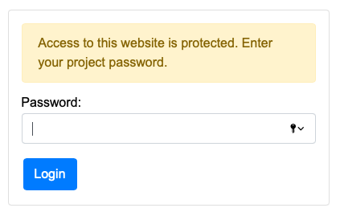

Privacy website firewall
========================

A simple library for securing access to the web.

Login is authenticated against a password (custom request authorizer can be implemented). The package automatically handles DDOS attack and overload mechanisms.

